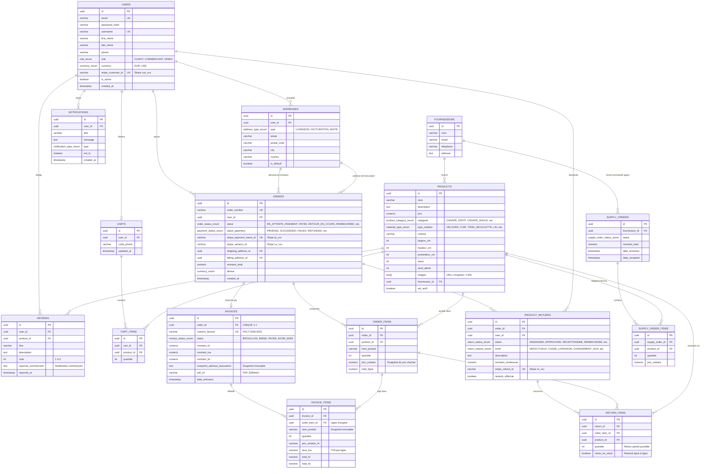

# Base de Données - Golden House

Ce dossier contient l'infrastructure et la modélisation de la base de données PostgreSQL pour le projet **Golden House** (M-Commerce Mobilier).

---

## 🚀 Démarrage Rapide (One-Click)

Pour lancer la base de données et l'interface graphique d'administration avec toutes les données de test préchargées :

```bash
cd backend
docker compose up -d
```

### 🖥️ Visualisation & Administration Web (Adminer)

Ouvrez votre navigateur sur : **[http://localhost:8080](http://localhost:8080)**

Renseignez les identifiants de connexion :
- **Système** : `PostgreSQL`
- **Serveur** : `postgres` *(ou `localhost` si exécuté hors du réseau Docker)*
- **Utilisateur** : `golden_user`
- **Mot de passe** : `golden_secret`
- **Base de données** : `golden_house_db`

> 💡 **Schéma relationnel visuel dans Adminer** : Une fois connecté, cliquez sur **« Schéma »** dans le menu de gauche d'Adminer pour voir le diagramme interactif des tables et de leurs relations.

---

## 📊 Diagramme Relationnel (ERD / MCD)

*Ce diagramme est interprété et rendu visuellement de manière native par GitHub.*



---

## 📁 Contenu des Scripts

- **`01-schema.sql`** : Script DDL complet avec création des extensions UUID, des types ENUM, des tables, contraintes d'intégrité référentielle (`ON DELETE CASCADE / RESTRICT`) et index de recherche.
- **`02-seed.sql`** : Jeu d'essai réaliste pour le MVP :
  - Fournisseurs de mobilier.
  - 5 modèles de canapés avec prix, dimensions, matières et photos HD.
  - Utilisateurs de test : un commerçant administrateur et un client avec identifiant Stripe.
  - Adresses de facturation et de livraison.
  - Commande test avec statut paiement Stripe `SUCCEEDED` et lignes de commande.
  - Factures légales `FACT-2026-0001/0002` (snapshot HT/TVA/TTC, PDF S3) et lignes de facture.
  - Commande livrée avec demande de retour `CASSE_LIVRAISON` et notification `RETOUR_STATUT`.
  - Avis client et réponse publique du commerçant.
