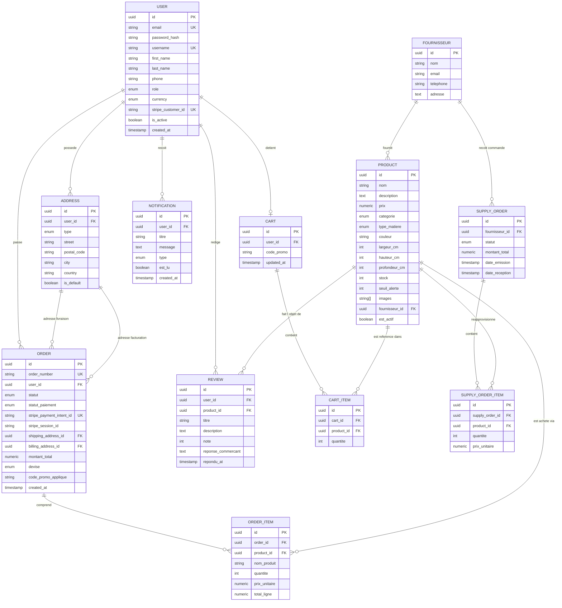

# Modélisation de la Base de Données - Golden House

Document de référence pour l'architecture des données du projet **Golden House** (M-Commerce Mobilier & Décoration).  
Module : **Ingénierie du Web Avancée 2 (IWA)** - Semestre 9 (Polytech Montpellier).

---

## 1. Origine & Évolution du Schéma

Ce schéma est issu de la synthèse des besoins fonctionnels du cahier des charges et des notes de cadrage manuscrites transmises par **Nabil Bennacer** (séance du 8 septembre 2026, archivée dans [`docs/Note 8 sept. 2026.pdf`](./Note%208%20sept.%202026.pdf)).

### 1.1. Analyse des notes initiales de Nabil

Dans sa proposition initiale, Nabil avait posé les bases de 7 entités clés :
- `User` (UserId, Email, Password, Username, isAdmin, Devise, Adresse)
- `Produit` (idProduit, Prix, catégorie [Enum LoveSeat, LivingRoom, Vintage], TypeMat, Couleur, Dimension, Stock, Description)
- `Panier` (idPanier, `<Product, Qty>`, CodePromo)
- `Commande` (idCommande, Adresse de livrai, Statut, Addr Factu, idPanier, idProduit, UserId, date, Montant)
- `Avis` (id, titre, Description, Note, idUser, idProduit, date)
- `Notification` (idNotif, titre, Description, Date, Statut, idUser)
- `Fournisseur` (idFournisseur, Nom, mail, numTel)

---

### 1.2. Corrections et optimisations majeures pour le MVP

Pour aboutir à un modèle de données relationnel normalisé (3NF), robuste, performant et adapté aux exigences du MVP :

1. **Entité Produit** :
   - **Ajout du nom du produit (`nom`)** : Oublié dans le brouillon initial.
   - **Ajout du champ `images` (tableau d'URLs)** : Indispensable pour l'affichage visuel sur l'application mobile React Native et le catalogue backoffice.
   - **Dimensions normalisées** : Séparation en `largeur_cm`, `hauteur_cm`, `profondeur_cm` (au lieu d'une chaîne brute) pour faciliter les filtres de recherche.
   - **Liaison Fournisseur** : Ajout d'une clé étrangère `fournisseur_id` pour rattacher chaque produit à son fabricant/grossiste.
   - **Seuil d'alerte (`seuil_alerte`)** : Pour déclencher automatiquement les alertes de stock bas vers les commerçants.

2. **Panier & Lignes de Panier (`Cart` & `CartItem`)** :
   - Normalisation de la notation `<Product, Qty>` via une table de liaison dédiée `cart_items` avec contrainte d'unicité `(cart_id, product_id)`.
   - Clé étrangère directe `user_id` sur `Cart` pour lier le panier au compte de l'acheteur.

3. **Commande & Lignes de Commande (`Order` & `OrderItem`)** :
   - **Correction de la modélisation Produit/Commande** : Dans le brouillon, `idProduit` était directement dans `Commande`, ce qui empêcherait de commander plusieurs articles différents par panier ! Création de la table `order_items`.
   - **Snapshot du prix au moment de l'achat** : Stockage de `prix_unitaire` et `total_ligne` dans `order_items` pour figer la facture même si le prix catalogue change ultérieurement.
   - **Découplage Panier / Commande** : La commande enregistre ses propres lignes pour conserver l'historique d'achat même si le panier est réinitialisé après le paiement.

4. **Adresses (`Address`)** :
   - Séparation en entité dédiée reliée à `User` avec distinction du type (`LIVRAISON`, `FACTURATION`, `MIXTE`) pour respecter la spécification du carnet d'adresses (Cahier des charges §3.1).

5. **Paiement avec Stripe** :
   - Stockage de `stripe_customer_id` (`cus_...`) dans `users`.
   - Stockage de `stripe_payment_intent_id` (`pi_...`) et `stripe_session_id` dans `orders`.
   - Enum `payment_status_enum` aligné sur le cycle de vie Stripe (`PENDING`, `REQUIRES_ACTION`, `SUCCEEDED`, `FAILED`, `CANCELED`, `REFUNDED`).

6. **Modération des Avis (`Review`)** :
   - Ajout des champs `reponse_commercant` et `repondu_at` pour implémenter la réponse publique commerçant demandée dans le backoffice.

7. **Réapprovisionnements Fournisseurs (`SupplyOrder` & `SupplyOrderItem`)** :
   - Formalisation des commandes fournisseurs pour concrétiser le workflow de réapprovisionnement décrit au §3.2 du cahier des charges.

---

## 2. Diagramme Entité-Association (Mermaid)

---

## 3. Choix d'outils : Prisma vs Spring Boot / SQL DDL

### La question posée :
> *« Tu penses le mieux c'est de créer le dossier backend et mettre cela dans prisma ? »*

### Recommandation d'architecture :

1. **Exigence académique IWA** : Le sujet officiel de Christophe Nauroy impose un backend micro-services majoritairement développé en **Spring Boot** (Java) adossé à **PostgreSQL**.
   - En Java / Spring Boot, le standard est **Spring Data JPA** (entités Java `@Entity`) ou des migrations SQL avec **Flyway** / **Liquibase**.
   - Prisma est un ORM exclusivement **TypeScript / Node.js**. Il ne remplace donc pas JPA dans les micro-services Java Spring Boot.

2. **La valeur ajoutée de Prisma pour l'équipe** :
   - **Clarté du DSL** : Le format `schema.prisma` est le format le plus lisible, expressif et clair pour modéliser visuellement et sans ambiguïté les entités et leurs relations.
   - **Prisma Studio** : Permet de lancer une interface web instantanée (`npx prisma studio`) pour inspecter, créer et modifier visuellement des données en base pendant les sessions de dev et démos.
   - **Intégration rapide** si un micro-service satellite (comme le serveur MCP ou un proxy BFF) est écrit en TypeScript.

3. **Organisation retenue dans le projet** :
   - **`backend/prisma/schema.prisma`** : Le schéma déclaratif complet, idéal pour visualiser et prototyper avec Prisma Studio.
   - **`backend/database/schema.sql`** : Le script SQL DDL PostgreSQL natif complet (types ENUM, tables, contraintes FK, index) directement utilisable par les micro-services Spring Boot et Docker.
   - **`backend/docker-compose.yml`** : Pour démarrer PostgreSQL 16 localement en une seule commande (`docker compose up -d`).
